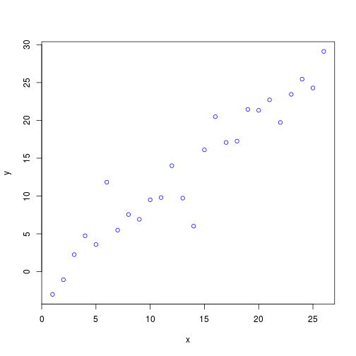

# Assigning variables

Try assigning the same value to multiple variables *in a single line of code*. 

Try reversing the direction in which the assignment operator `<-` is pointing. What happens? Try writing a single command that uses assignment operators pointing in both directions?

# Subsetting data

Compare the outputs of the following commands. Why are they different? Hint: The `class()` and `str()` functions may be useful to you.


```r
dat[5,]
dat[,5]
dat[5]
dat[[5]]
```

# The apply function

The `array()` function in R is used to create arrays of arbitrary dimensionality. A `vector` is just an `array` with one dimension, and a `matrix` is an array with two dimensions. For this exercise, do the following: 

1. Create a vector containing the numbers 1 through 27.
2. Create a 3D array with dimensions 3x3x3. How are the numbers organized in the array?
3. Use the `apply` function to calculate the maximum value in each row. What is the shape of the output?
4. Repeat (3), but for columns.
5. Repeat (3), but for depth (i.e. third dimension).
6. How would you calculate the mean by both row *and* column? BONUS: How would you do this using only a single `apply` command? Hint: Carefully read the documentation for the `dim` argument of the `array` function.

# Plotting

Using the following data...


```r
x <- 1:26
y <- x + rnorm(26, 0, 3) 
```

...create the following plots. Hint: Look at the documentation for the `plot` and `par` functions. Googling "r graphical parameters" may help you as well.




Hint: Check out the `lines()` function and the `letters` object. 

